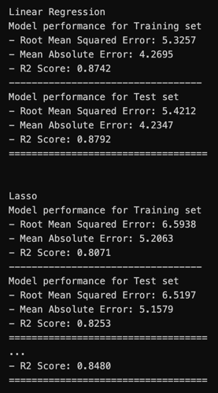

# Packaged student score ML project

Student score prediction project, BUT in a python package environment

Find Jupyter notebook visualization graphs in: `notebook/EDA STUDENT PERFORMANCE.ipynb`

Find Jupyter notebook model training in: `notebook/MODEL TRAINER.ipynb`

### Run flask front-end to test prediction
Environment: venv python=3.8
* `conda create -p venv python=3.8 -y`
* `conda activate venv/`

`pip install -r requirements.txt`

`python app.py`

### Some Results

